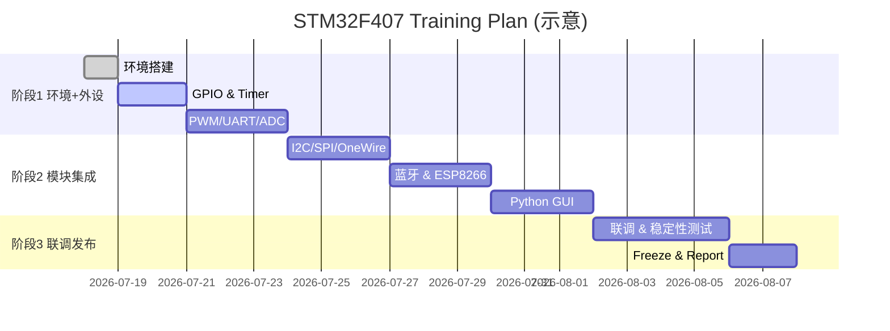

# STM32

---

<!-- BEGIN: STM32 Training Full Analysis -->
# 🌟 STM32F407 实训 — 超详尽项目整理与教学分析（完整版）
> 版本：v1.0  
> 说明：本文件为非代码版的全面训练分析、教学设计与项目管理手册，基于你提供的 28 天任务清单。包含学习目标、模块分解、评估量表、风险与应急、采购清单、课堂提示与装饰建议（徽章/图标/Mermaid 图）。  
> 注意：文档不包含具体实现代码；若需要代码模块我可在后续按你的要求补充。

  

---

## 目录（快速导航）
- 执行摘要与目标回顾
- 受众与前置要求
- 学习成果（可量化 KPIs）
- 教学分阶段与模块总览
- 每模块教学要点、演练与验收（详尽）
- 课程日常管理：检查点、提交格式、教师脚本
- 评估与评分体系（评分细则、示例表格）
- 资源采购、设备分配与预算估算
- 风险矩阵与应急响应计划
- 常见故障大全（类别化，含诊断要点与处理步骤）
- 教学效能优化建议（并行化、分工、时间压缩）
- 延伸项目与考试/验收题库建议
- 可视化与装饰建议（徽章/配色/Mermaid 图）
- 输出与后续工作（PDF/海报/检查脚本等）
- 附录：样板检查单、示意图表与甘特图（Mermaid）

---

## 一、执行摘要与目标回顾（为什么做这个训练）
- 总目标：使学员能独立完成 STM32F407 从环境搭建、外设驱动、传感器集成、通信（蓝牙/WiFi）、到上位机可视化的端到端工程交付。  
- 训练定位：工程化实践课 + 项目交付（偏应用、强调调试与稳定性、辅助 AI 工具作为生产力提升）。  
- 最终交付：每组提交 Git 仓库（含 README、接线图、测试日志、演示视频）、端到端演示（实时数据采集→传输→可视化）与最终报告。

---

## 二、受众与前置要求（Who / Pre-req）
- 受众：有 C 语言或嵌入式基础的本科生/工程师；完全零基础学员需额外 1—2 天入门。  
- 个人/硬件准备（学员）：Windows 10+（或等价环境）、VS Code、Node.js、Git、可接入网络、至少一套 STM32F407 开发板与基础传感器（或由实验室集中分发）。  
- 教师/助教：1 名主讲 + 若干助教（建议 1:6 学员比）。助教需熟悉 PlatformIO、ST-Link 驱动、常见模块调试。  
- 课程前置任务（必做）：环境检查脚本运行截图、Git 帐号配置截图、PlatformIO 初次编译测试截图（Blink 或空项目）。

---

## 三、学习成果（Learning Outcomes / KPIs，可量化）
1. 环境准备 KPI
   - PlatformIO 能成功编译并通过 ST-Link 烧写 Blink（目标通过率 ≥ 95%）。
2. 外设掌握 KPI
   - 至少 10 个外设 demo（GPIO、Timer、PWM、UART、ADC、I2C、SPI、OneWire、DAC/DMA、外部中断）完成且能解释其工作原理（一次通过率 ≥ 80%）。
3. 集成与系统 KPI
   - 完成端到端系统（采集节点 → 汇总节点 → ESP8266 → PC 可视化），延迟 ≤ 1s，连续运行 1 小时无崩溃。
4. 工程化 KPI
   - 每组必须提交 Git 仓库（包含 commit 历史、README、接线图、测试视频），代码模块化、注释完整。
5. 故障排查 KPI
   - 在给定两处典型故障日志的情况下，学员能在 30 分钟内定位并给出修复方案（正确率 ≥ 80%）。

---

## 四、教学分阶段与模块总览（What / How）
- 阶段1（环境搭建与外设基础，Day1—Day12）
  - 目标：完成环境安装（VS Code/PlatformIO/Node/Git）、ST-Link 驱动、创建第一个工程（Blink）；掌握 GPIO、Timer、PWM、UART、ADC、外部中断的基本用法与调试方法。
- 阶段2（模块集成，Day13—Day24）
  - 目标：驱动并整合关键传感器（BH1750、MPU6050、DS18B20、HC-SR04）；实现蓝牙通信（HC-05）与 WiFi 转发（ESP8266）；设计并实现数据帧协议；实现 PC 端 Python 可视化（实时曲线/仪表盘）。
- 阶段3（联调与发布，Day25—Day28）
  - 目标：端到端联调、稳定性测试、优化（如低功耗、容错）、版本冻结、项目演示与总结。

每个模块都应包含：
- 理论要点（不超过一页 PPT）  
- 最小可运行 Demo（MVP）与验证标准  
- 常见误区与调试流程（助教备查）  
- 扩展练习（加分项）

---

## 五、每模块教学要点与验收（详尽，供教师讲稿使用）
（下列每项均为教学要点摘要；课堂中按此结构讲解 + 演示 + 学员上板实践）

A. 环境与工具链（Day0/Day1）
- 要点：Windows 用户名/路径无中文、Node/Git/PlatformIO/VSCode 安装、PlatformIO 项目创建流、platformio.ini 含义、ST-Link 驱动安装与检测。  
- 验收：学员能在 30 分钟内完成环境检测脚本的所有通过项，并成功烧写 Blink。

B. GPIO 与按键（Day2）
- 要点：推挽/开漏、上拉/下拉、输出驱动能力、中断 vs 轮询、去抖（延时/定时器/状态机）。  
- 实验：LED 流水灯、按键短按/长按识别。  
- 验收：按键触发 LED 行为正确；按键消抖可靠（用 10 次快速按压无误判）。

C. 定时器与 SysTick（Day4）
- 要点：SysTick 与 HAL_Delay 原理、TIMx 基本配置、输入捕获、输出比较、定时器中断。  
- 实验：1Hz/2Hz/5Hz 精确闪烁；使用输入捕获测量脉宽（超声波）。  
- 验收：频率在 ±1% 误差内；输入捕获测量误差 < 5%。

D. PWM 与舵机（Day5）
- 要点：PWM 原理（占空比/频率）、Timer 输出比较、驱动舵机（脉宽对应角度）。  
- 实验：LED 呼吸、SG90 舵机角度控制（0°, 90°, 180°）。  
- 验收：舵机到位稳定，角度偏差 < 5°。

E. UART 串口（Day6）
- 要点：波特率/帧格式、HAL UART API、printf 重定向、轮询/中断/DMA 模式。  
- 实验：串口打印传感器数据、PC 端发送指令控制 MCU。  
- 验收：双向通信稳定，误码率可忽略。

F. ADC / DAC / DMA（Day7-Day8）
- 要点：ADC 模式（单次/连续/扫描）、采样时间与噪声、DMA 使用、DAC 输出与波表生成。  
- 实验：读电位器 → 串口打印；ADC + DMA 连续采样；DAC 输出正弦（查表法）。  
- 验收：ADC 精度（12 位）读数稳定；DMA 传输无丢帧。

G. I2C（Day9-Day10）
- 要点：I2C 起始/停止/ACK/NACK、地址（7/10 位）、硬件 SDA/SCL 上拉、扫描工具。  
- 实验：驱动 SSD1306 OLED、BH1750、MPU6050（基本读取/中断/可能的 DMP）。  
- 验收：I2C 设备能被扫描到，数据解析正确，OLED 显示无错位。

H. OneWire / SPI（Day11）
- 要点：OneWire 时序严格、温度传感器 DS18B20；SPI 总线（MODE、CPOL、CPHA）。  
- 实验：读取 DS18B20 温度、驱动 MAX7219（点阵）。  
- 验收：温度读取稳定且在合理范围。

I. 超声波（Day12）
- 要点：Trig/Echo 时序、输入捕获测时、速度常量与环境误差。  
- 实验：实时距离测量并在 OLED/PC 端显示，距离 <10cm 报警。  
- 验收：距离测量误差 <5%。

J. 蓝牙（HC-05）与 ESP8266（Day13—Day19）
- 要点：AT 模式、波特率、主从配对、串口透传；ESP8266 AT 指令、WiFi 连接与 TCP/UDP 发送。  
- 实验：两块 F407 通过蓝牙通信；F407 → ESP8266 → PC 端 socket 接收。  
- 验收：蓝牙链路稳定（10m 内无丢帧）；ESP8266 能持续上报数据。

K. 上位机 Python 可视化（Day20—Day22）
- 要点：pyserial、matplotlib 动态绘图、PyQt5 简单仪表盘设计、数据保存 CSV。  
- 实验：实时曲线（温度/光照/距离/姿态角）；支持暂停/保存/回放功能。  
- 验收：多通道实时更新，延迟 ≤1s。

L. 系统联调、稳定性与优化（Day23—Day28）
- 要点：看门狗（IWDG）、通信超时重连、内存泄露检测、日志与远程升级策略（OTA）设计。  
- 实验：连续运行 2 小时并记录内存/丢包/CPU 占用；修复内存泄露或死锁。  
- 验收：连续运行稳定 ≥2 小时，所有关键功能不崩溃。

---

## 六、课程日常管理：检查点、提交格式、教师脚本（Operate）
A. 每日检查点（学员需在课堂结束前提交）
- 简短日报（1 页）：完成事项、遇到的问题、下一步计划（提交到班级 GitHub Issues 或 Google Form）。  
- Demo 提交：当天的最小可运行 demo（源文件 + 截图/视频）、平台（Git）提交并打上当日标签。  
- 环境截图（首两天必须提交）：Node/Git/PlatformIO 版本、ST-Link 识别截图。

B. 提交模板（README excerpt）
- 项目根 README 必含：
  - 简要介绍（3 行）  
  - 如何编译/烧录（platformio.ini 说明）  
  - 接线图（PNG）与硬件清单（BOM）  
  - 演示视频或截图链接  
  - 已知问题与 TODO 列表

C. 教师讲稿（每日要讲/演示要点，时间分配建議）
- Day 示例（第一天）
  - 08:30—09:00：环境检查与常见问题速览（示例截图）  
  - 09:00—10:00：示范 PlatformIO 新建工程、platformio.ini 讲解（PPT 5 页）  
  - 10:00—12:00：学员上机安装、助教巡视、即时排错  
  - 13:30—15:30：示范 ST-Link 烧写 Blink、演示串口输出（学员跟随）  
  - 15:30—17:30：Claude Code 使用示范（如何把编译错误粘贴给 AI 获取修复建议）

---

## 七、评估与评分体系（评分表模板）
- 建议分数（满分 100）
  - 功能完成度：40（按验收清单打分）  
  - 代码质量与工程化：20（模块化、注释、Commit）  
  - 文档与演示：15（README、接线图、视频）  
  - 稳定性测试：15（连续运行、容错处理）  
  - 创新/优化：10（扩展功能、改进建议）

评分细则示例（教师可直接复用）
- 功能完成度（40）
  - 每个通过的外设 demo +2 分（最多 20 分）  
  - 端到端演示成功：+10 分  
  - 响应延迟与数据正确性：+10 分

---

## 八、资源采购、分配与预算（Consumables & Logistics）
A. 基础套件（每组）
- STM32F407 核心板（含 ST-Link） ×1  
- USB A→Micro 线 ×1  
- 面包板 ×1、杜邦线若干、LED、220Ω、电阻、电位器 ×各若干  
- 传感器：BH1750、MPU6050、DS18B20、HC-SR04 各 1（可选备用）  
- 通信模块：HC-05 ×1、ESP8266 ×1、USB-TTL（CH340） ×1  
- SG90 舵机 ×1、蜂鸣器 ×1、3.3V 电源模块 ×1（300–1000mA）  
- 预算估算：每组约 $80—$150（视模块品牌与采购渠道）

B. 教学设备与租借
- 教室需配备 WiFi、投影、若干台演示 PC（主讲用）  
- 建议准备 10% 的备用板与模块（应对故障）

---

## 九、风险矩阵与应急响应（Risk & Mitigation）
- 风险：路径含中文导致编译失败（概率高/影响中）  
  - 缓解：强制要求前置环境检查、提供快速迁移脚本（自动将工程移到 C:\Projects），课堂提前完成。  
- 风险：DeepSeek/Claude API 不可用（概率中/影响高）  
  - 缓解：准备无 AI 的教学示例代码库与人工排查手册。  
- 风险：ESP8266 供电不足（概率中/影响高）  
  - 缓解：独立 3.3V 电源模块，并标示连接注意事项。  
- 风险：学员基础参差（概率高/影响中）  
  - 缓解：分层教学、助教扶持、早期测评分组。

应急响应流程（示例）
1. 出现网络/AI 服务中断 → 切换到离线示例、助教现场讲解；通知学员临时调整计划。  
2. 关键硬件损坏 → 立即启用备用板并调整小组合并使用。  
3. 大面积环境问题（PlatformIO/驱动）→ 暂停实操，做集中线上引导修复并延长该日练习时间或安排补课。

---

## 十、常见故障大全（分区域，含诊断要点与处理步骤）
- 环境类问题（安装/路径/权限）  
  - 诊断线索：编译日志包含 “non-ASCII” / “path not found”  
  - 处理：迁移路径、修改用户名、使用短路径、重装 PlatformIO

- 驱动与连接（ST-Link / USB）  
  - 诊断线索：设备管理器无 ST-Link、或 upload 错误 “no device”  
  - 处理：更换 USB 线、安装 Zadig/官方驱动、检查线缆与接口

- I2C / SPI / OneWire 总线问题  
  - 诊断线索：NACK / 读不到设备 / CRC 错误  
  - 处理：检查地址、上拉电阻、模块供电、逻辑电平；用扫描工具确认设备地址

- 串口通信问题  
  - 诊断线索：AT 指令无响应、乱码  
  - 处理：确认波特率、串口参数（停止位/校验位）、电平转换

- 运行稳定性（死机/重启/内存暴涨）  
  - 诊断线索：系统日志、看门狗复位、FreeRTOS 堆栈溢出  
  - 处理：启用堆栈监测、检查任务优先级、减小动态内存分配，使用 Valgrind-like 分析（PC-side）

（在课堂资料库中维护一个可搜索的 FAQ，按模块分类）

---

## 十一、教学效能优化建议（提高通过率与满意度）
- 事前：发环境一键检测脚本 + 安装视频（强制在开课前完成）  
- 课堂：采用微讲座（15—20 分钟）+ 45—60 分实践循环；助教巡回答疑（1:6 比例）  
- 项目管理：每日 PR/提交并写短日报，助教在 24 小时内给反馈  
- 并行化：阶段2 将任务拆为 3 个并行线路（采集/汇总/可视化），最后合并联调  
- 便捷复用：准备 “最小可运行 demo 库” 供卡在问题的学员导入直接运行，避免卡住拖慢进度

---

## 十二、延伸项目、考试题与验收题库建议
- 延伸项目（加分）
  - OTA 远程升级实现（ESP8266 + 验证签名）  
  - 使用 CMSIS-DSP 实现实时滤波/FFT 并在 GUI 显示频谱  
  - 低功耗模式下的数据采集与上报（深睡眠 + 外部唤醒）
- 考试/验收题（示例）
  - 设计题：给出第三方传感器数据手册，在 2 小时内设计并实现驱动（含初始化与读取示例）。  
  - 理论题：解释 Timer 输入捕获原理并画出信号时序图。  
  - 实操题：给定出现 UART 串口乱码的日志，写出排查步骤并修复（附截图）。

---

## 十三、可视化与装饰建议（徽章 / 图标 /版式）
- 顶部徽章：状态/MCU/时长/RTOS/AI（shields.io）  
- 文档配色：主色 #0b5cff（深蓝），辅色 #ffb400（橙），背景 #f7f9fc（浅灰）  
- 图标库：Font Awesome + Emoji（⚙️ 🧪 📡 📈）  
- Mermaid 图（示意）
  - 架构图（采集→汇总→WiFi→PC）  
  - 甘特图（训练计划 28 日时间轴）  
  - 看板流程（Backlog → Doing → Review → Done）
- 海报布局建议（A4）
  - 左半页：课程总览与时间轴；右上：当日要点；右下：验收清单与联系方式（助教）

Mermaid 甘特示例（可直接渲染）

---

## 十四、输出与后续工作（我可以立即帮你做）
- 把这份 Markdown 渲染并导出为：  
  A) 高质量 PDF（A4），含目录、徽章与 Mermaid 图（适合打印/发学员）。  
  B) 三张海报 PNG（课程总览、Day1 检查、验收清单）用于张贴。  
  C) 教师版评分表 Excel（含公式与示例分数）。  
  D) 学员速查卡 PDF（A4 一页）。  
  E) 一键环境检测脚本（PowerShell）和使用说明（用于开课前检查）。  
- 你现在可以回复所需的输出编号（A/B/C/D/E），或说“全部”，我会马上开始生成对应文件并把下载链接/嵌入内容发给你。

---

## 附录：学员/教师快速检查单（可打印）
- 学员速查（首日必做）
  - [ ] Windows 10+，用户名/路径无中文或空格  
  - [ ] Git 安装并配置（user.name / user.email）  
  - [ ] Node.js 安装（LTS）、npm 可用  
  - [ ] VS Code & PlatformIO 安装完成  
  - [ ] ST-Link 驱动安装并识别设备  
  - [ ] 第一个 Blink 已烧写并运行（截图）

- 教师速查（日常）
  - [ ] 助教数量充足（1:6 比例）  
  - [ ] 当日任务与验收点已明确并张贴在教室  
  - [ ] 备用硬件/电源/USB 线在手  
  - [ ] AI 服务（DeepSeek）账号与备用账号已准备

---

<!-- END: STM32 Training Full Analysis -->
