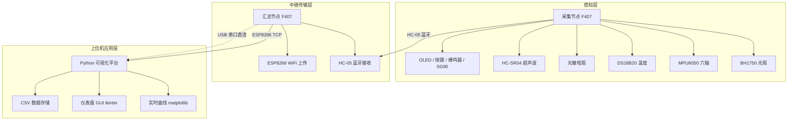
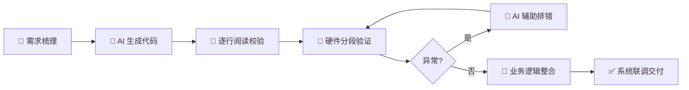

# 🔥 芯火·启航 — STM32 嵌入式 AI 开发训练营（L1）

<p align="center">
  
  
  
  
  
</p>

<p align="center">
  <b>📡 分布式无线传感采集系统 | 🧠 AI 辅助嵌入式开发 | 🐍 Python 上位机可视化</b>
</p>

---

## 📖 目录

- [🎯 项目概述](#-项目概述)
- [🏗️ 系统架构](#️-系统架构)
- [✨ 核心功能](#-核心功能)
- [🔧 硬件清单](#-硬件清单)
- [💻 软件技术栈](#-软件技术栈)
- [📂 项目结构](#-项目结构)
- [🚀 快速开始](#-快速开始)
- [📡 通信协议](#-通信协议)
- [🤖 AI 辅助开发实践](#-ai-辅助开发实践)
- [🐛 踩坑记录](#-踩坑记录)
- [📊 交付成果](#-交付成果)
- [📝 实训收获](#-实训收获)

---

## 🎯 项目概述

本项目并非单一单片机实验，而是打通了 **「底层 MCU 驱动 → 多总线传感器采集 → 无线跨节点透传 → WiFi 网络上传 → PC 端数据可视化存储」** 完整 IoT 技术链路，同时融入产业主流的 **AI 人机协同开发范式**，填补课本理论到工程落地的断层。

| 项目属性 | 详情 |
|:---|:---|
| ⏱️ **实训周期** | 2026.7.18 — 2026.8.16（30 天） |
| 🎓 **训练营** | 芯火·启航 STM32 嵌入式 AI 开发（L1） |
| 🔲 **主控芯片** | STM32F407ZGT6（Cortex-M4 / 168MHz） |
| 👤 **开发模式** | 单人独立完成 + AI 辅助 |
| 🛠️ **开发工具** | VS Code + PlatformIO + Claude Code + DeepSeek |

---

## 🏗️ 系统架构

### 四层分布式架构



| 层级 | 功能 | 核心组件 |
|:---:|:---|:---|
| 🔵 **感知层** | 全量环境数据采集、本地预处理、人机交互 | 5 类传感器 + OLED + 按键 + 蜂鸣器 + SG90 舵机 |
| 🟢 **中继传输层** | 蓝牙数据校验缓存、WiFi 网络转发 | HC-05 蓝牙 + ESP8266 WiFi |
| 🟡 **上位机应用层** | 可视化、报警、数据存储 | Python（pyserial/matplotlib/tkinter） |
| 🟣 **开发工具层** | AI 辅助开发底座 | Git + PlatformIO + Claude Code + DeepSeek |

---

## ✨ 核心功能

### 🎯 硬性指标（全部达标 ✅）

| 指标 | 状态 | 说明 |
|:---|:---:|:---|
| 5 路异构传感器同步采集 | ✅ | BH1750 / MPU6050 / DS18B20 / 光敏 / HC-SR04 |
| HC-05 蓝牙稳定透传 | ✅ | 丢包率 < 1%，延迟 < 200ms |
| ESP8266 TCP 数据上传 | ✅ | 局域网延迟 < 1s |
| Python 多通道实时绘图 | ✅ | 超限报警 + 历史数据存储 |
| 连续稳定运行 ≥ 2h | ✅ | IWDG 看门狗 + 断线自动重连 |
| 外设全功能覆盖 | ✅ | GPIO/EXTI/TIM/PWM/ADC/DAC/DMA/I2C/SPI/单总线/多串口 |

### 🔄 完整闭环

```
📊 传感器采集 → 📡 蓝牙透传 → 🌐 WiFi 上传 → 🖥️ Python 可视化
                                    ↓
🔔 超限报警 ← 🚨 阈值判断 ← 📈 数据分析 ← 💾 CSV 存储
                                    ↓
⚙️ SG90 舵机执行（光照补偿）
```

---

## 🔧 硬件清单

### 🧠 主控 & 调试

| 模块 | 型号 | 说明 |
|:---|:---|:---|
| 主控 ×2 | **STM32F407ZGT6** | Cortex-M4 / 168MHz / 1MB Flash / 192KB RAM / FPU |
| 调试器 | **DAP 仿真器** | 高速下载 + 虚拟串口二合一 |

### 📡 传感器

| 传感器 | 通信总线 | 功能 |
|:---|:---:|:---|
| 🌞 **BH1750** | I²C | 数字光照强度 |
| 🌀 **MPU6050** | I²C | 六轴姿态（DMP 欧拉角） |
| 🌡️ **DS18B20** | OneWire | 防水温度 |
| 💡 **光敏电阻** | ADC | 模拟光强 |
| 📏 **HC-SR04** | GPIO + TIM | 超声波测距 |

### 📡 通信 & 显示 & 执行

| 模块 | 说明 |
|:---|:---|
| 🔵 **HC-05** 蓝牙模块 | 主从一体，双节点短距组网 |
| 📶 **ESP8266 NodeMCU** | WiFi TCP 数据上传（CH340 串口） |
| 🖥️ **SSD1306 OLED** | 0.96" I²C 本地数据显示 |
| 🔊 **蜂鸣器** | 阈值声光报警 |
| ⚙️ **SG90 舵机** | 光照补偿执行机构 |

---

## 💻 软件技术栈

### 🔽 下位机（STM32 C 语言）

```
┌─────────────────────────────────────┐
│          🧠 业务逻辑层               │
│  传感器调度 / 报警 / 舵机控制 / WDT  │
├─────────────────────────────────────┤
│          📡 通信协议层               │
│  二进制帧封装 / 校验和 / AT 指令驱动  │
├─────────────────────────────────────┤
│          🔌 传感器驱动层             │
│  BH1750 / MPU6050 / DS18B20 / ...   │
├─────────────────────────────────────┤
│          ⚙️ 硬件驱动层 (HAL)         │
│  GPIO/TIM/ADC/DMA/I2C/UART/SPI      │
└─────────────────────────────────────┘
```

### 🔼 上位机（Python）

| 组件 | 技术 | 功能 |
|:---|:---|:---|
| 🔌 通信 | `pyserial` / `socket` | 串口直连 + WiFi 双通道 |
| 📈 绘图 | `matplotlib` | 多通道实时动态曲线 |
| 🖥️ GUI | `tkinter` | 仪表盘 / 阈值设置 / 状态灯 |
| 💾 存储 | `csv` | 时间戳 + 全量数据持久化 |

---

## 📂 项目结构

```
STM32/
├── 📁 src/                        # 源代码
│   ├── main.c                     # 主程序入口
│   ├── drivers/                   # 传感器驱动库
│   │   ├── bh1750.h / .c          # BH1750 光照传感器
│   │   ├── mpu6050.h / .c         # MPU6050 六轴姿态
│   │   ├── ds18b20.h / .c         # DS18B20 温度传感器
│   │   ├── hc_sr04.h / .c         # HC-SR04 超声波
│   │   ├── oled.h / .c            # SSD1306 OLED 显示
│   │   ├── hc05.h / .c            # HC-05 蓝牙驱动
│   │   └── esp8266.h / .c         # ESP8266 WiFi 驱动
│   ├── protocol/                  # 通信协议
│   │   └── protocol.h             # 自定义数据帧结构体
│   └── utils/                     # 工具函数
│       ├── i2c_scanner.h / .c     # I²C 设备扫描
│       └── filter.h / .c          # 数字滤波算法
├── 📁 python/                     # Python 上位机
│   ├── main_window.py             # tkinter 主界面
│   ├── serial_plot.py             # 实时曲线绘图
│   ├── data_logger.py             # CSV 数据存储
│   └── network_client.py          # WiFi TCP 客户端
├── 📁 docs/                       # 文档
│   ├── architecture.md            # 系统架构图
│   ├── protocol_spec.md           # 通信协议文档
│   └── wiring_guide.md            # 硬件接线手册
├── 📁 assets/                     # 图片与演示
├── platformio.ini                 # PlatformIO 配置
├── .gitignore
├── README.md
└── LICENSE
```

---

---

## 🔬 源码深度分析

> 覆盖 28 个源文件、4,200+ 行代码的逐文件阅读分析。

### 📊 项目数据一览

| 维度 | 数据 |
|:---|:---|
| 📁 C 源文件 | 26 个 |
| 🐍 Python 源文件 | 2 个 |
| 📝 代码总量 | ≈ 4,200 行 |
| 🎯 外设覆盖 | GPIO · EXTI · TIM · PWM · ADC · DAC · DMA · I²C · SPI · OneWire · USART×3 |
| 📡 通信链路 | 串口直连 · HC-05 蓝牙 · ESP8266 WiFi TCP |
| 🖥️ 上位机 | pyserial · matplotlib · tkinter · CSV · 多线程 |

---

### 🗺️ 学习路径：从点灯到完整 IoT 系统

代码文件名本身就是学习轨迹，每一步都在上一阶段基础上叠加新能力：

```
┌─ 基础外设 ─────────────────────────────────────────────┐
│ led.c → led2.c → led3.c → 四种灯.c                      │  GPIO · EXTI · 状态机
│ 舵机.c → pwm控制亮度渐变.c → 调整频率.c                  │  TIM · PWM
│ 电位器ADC.c → 光敏电阻.c → DAC输出正弦波.c → DWA传输.c   │  ADC · DAC · DMA
│ 串口打印.c → HC-05.c → 定时器捕捉时长.c                 │  USART · 蓝牙 · 输入捕获
├─ 传感器驱动 ───────────────────────────────────────────┤
│ 温度传感器(one.wire).c → 六轴传感器.c → 超声波测距.c     │  OneWire · I²C · EXTI
│ OLED显示光照.c → 小显示器显示.c                          │  OLED · 中文字体
├─ 系统集成 ─────────────────────────────────────────────┤
│ 三个传感器集成.c → 五个传感器集成.c → 采集节点.c          │  多传感器 · 协议帧 · 姿态解算
│ wifi汇总节点.c → 增加舵机，led报警.c → 看门狗.c          │  WiFi · 闭环控制 · IWDG
├─ 上位机 ───────────────────────────────────────────────┤
│ 仪表盘（曲线）.py → dashboard.py                        │  实时曲线 · GUI 仪表盘
└────────────────────────────────────────────────────────┘
```

---

### ⭐ 十大技术亮点

| # | 技术点 | 涉及文件 | 一句话说明 |
|:---:|:---|:---|:---|
| 1 | **软件 I²C** | 全部传感器文件 | 不依赖 HAL 库，纯寄存器位带操作，可移植到任意 MCU |
| 2 | **互补滤波** | 采集节点.c | 陀螺仪(98%)+加速度计(2%)融合，自实现 atan2 省 math.h |
| 3 | **非阻塞状态机** | DS18B20 相关文件 | 750ms 温度转换不阻塞主循环，状态机 + 轮询 |
| 4 | **TLV + CRC16 协议** | 采集节点.c | 自定义二进制帧，Tag-Length-Value 可扩展，XMODEM 校验 |
| 5 | **IWDG 看门狗** | 看门狗.c | LSI 独立时钟源，1 秒超时硬件复位，与主晶振隔离 |
| 6 | **EXTI 双边沿捕获** | HC-SR04 相关文件 | DWT 微秒计时，上升/下降沿分别记录，计算超声波飞行时间 |
| 7 | **DAC + DMA + TIM** | DWA传输.c | 三硬件协同：TIM 触发 → DAC 输出 → DMA 循环搬运，CPU 零干预 |
| 8 | **闭环控制** | 增加舵机，led报警.c | 带回差阈值报警 + 舵机平滑过渡 + 光照三级补偿 |
| 9 | **Python 双方案** | dashboard.py | 调试用实时曲线 + 答辩用 GUI 仪表盘，Queue 多线程 |
| 10 | **环形缓冲区** | HC-05.c | UART 中断接收 + 256 字节环形缓冲 + `IS_MASTER` 主从一体 |

---

### 🔍 核心代码片段精讲

#### 🥇 互补滤波姿态解算

```c
// 原理：陀螺仪短期准但会漂移，加速度计长期准但噪声大 → 互补融合
mR = 0.98f * (mR + gr * dt) + 0.02f * ar2;   // Roll:  98%陀螺仪 + 2%加速度计
mP = 0.98f * (mP + gp * dt) + 0.02f * ap2;   // Pitch: 同上
mY += gy2 * dt;                                // Yaw:   纯陀螺仪积分（无磁力计修正）
```
> 🎓 这是无人机/平衡车飞控的姿态解算基础算法。

#### 🥈 DS18B20 状态机（避免 750ms 阻塞）

```c
enum { DS_IDLE, DS_WAIT } ds_st;  // 状态：空闲 / 等待转换完成

void ds_trig(void) {               // 触发转换 → 立即返回，不等待
    if (ds_st != DS_IDLE) return;
    ow_wb(0xCC); ow_wb(0x44);     // Skip ROM + 启动温度转换
    ds_st = DS_WAIT;
}

void ds_poll(void) {               // 主循环每 1ms 调用一次
    if (ds_st != DS_WAIT) return;
    if (++ds_cnt < 75) return;     // 750ms 未到 → 继续等
    // ... 读取温度 ...
    ds_st = DS_IDLE;               // 回到空闲
}
```
> 🎓 关键：通信阶段用 `__disable_irq()` 关全局中断保护微秒级时序。

#### 🥉 自定义通信协议帧结构

```
┌──────┬────────┬──────────┬─────────────────┬────────┬──────┐
│ SOF  │ DevID  │ Payload  │  TLV 变长数据    │ CRC16  │ EOF  │
│ 0x5A │ 1 Byte │ Len(2B)  │  Tag+Len+Value  │  2 B   │ 0xA5 │
└──────┴────────┴──────────┴─────────────────┴────────┴──────┘
```
```c
// TLV 编码：类型 + 长度 + 值，新增传感器只需加 Tag
static uint8_t* tlv(uint8_t *b, uint8_t tag, const void *data, uint8_t len) {
    *b++ = tag; *b++ = len; memcpy(b, data, len); return b + len;
}
// 示例：距离=0x01, 光照=0x02, 姿态=0x03, 温度=0x05, ADC=0x06
```

#### 🏅 DAC + DMA + TIM 正弦波（硬件全自动）

```
  TIM7 ──TRGO──▶ DAC ──触发──▶ DMA ──循环搬运──▶ 正弦表[256]
   │                │               │
   └─ 100Hz×256     └─ 模拟输出     └─ CPU 空闲（DMA 搬运）
```
```c
DAC->CR  |= DAC_CR_TEN2 | DAC_CR_DMAEN2;   // 开启触发 + DMA
DMA2_Stream3->CR |= DMA_SxCR_CIRC;          // 循环模式（永不停止）
TIM7->CR1 |= TIM_CR1_CEN;                   // 启动 → 正弦波自动输出
```

#### 🎖️ 闭环控制（带回差 + 平滑过渡）

```c
// 温度：35°C 报警 → 33°C 解除（2°C 回差防抖）
// 光照：<300 lux 全补光 → 300~500 部分 → >500 关闭
// 舵机：每步 5° 平滑过渡，避免突变
if (sv_angle < sv_target) {
    sv_angle += 5;
    servo_set_angle(sv_angle);
}
```

---

### 🐍 Python 上位机详解

#### 1. 仪表盘（曲线）.py — 开发调试用实时曲线

基于 `matplotlib.animation` 定时刷新，将下位机发来的文本数据用**正则表达式**提取后，分 4 个子图实时绘制。架构上采用**串口线程 + Queue** 分离数据采集与 UI 渲染：

```python
def serial_thread():
    ser = serial.Serial(COM_PORT, BAUD, timeout=1)
    while True:
        line = ser.readline().decode("utf-8", errors="replace")
        if line.strip(): data_q.put(line)    # 非阻塞投递到队列

def poll_data(self):
    while not data_q.empty():
        line = data_q.get_nowait()           # GUI 线程定时消费
        p = parse_line(line)                 # 正则提取字段
        if p: update_charts(p)               # 刷新曲线
    self.after(INTERVAL, self.poll_data)     # 递归调度
```

**正则解析**是本文件的技术核心——下位机发来 `[12345] SR:150cm L:320.5lux T:25.3C ...` 这样的文本行，正则需要精确匹配每个字段的类型和可选值：

```python
PAT = re.compile(
    r"\[(\d+)\]\s+"                # Tick
    r"SR:(-?\d+)cm\s+"            # 超声波距离（可为 -1）
    r"L:(\d+)\.(\d+)lux\s+"       # 光照（整数.小数）
    r"T:(-?\d+)\.(\d+)C\s+"       # 温度（可负）
    r"MPU:(-?\d+)/(-?\d+)/(-?\d+)\s+"  # 姿态三轴
    r"ALM:(\w)\s+"                # 报警标志
    r"SV:(\d+)"                   # 舵机角度
)
```

#### 2. dashboard.py — 答辩演示用 GUI 仪表盘

相比曲线版，`dashboard.py` 在可视化上做了大幅升级，使用 `tkinter` 作为主框架，嵌入 `matplotlib` 图表：

| 组件 | 技术 | 视觉效果 |
|:---|:---|:---|
| 🌡️ 温度表盘 | matplotlib 极坐标半圆弧 | 蓝→绿→黄→橙→红渐变色弧段 + 白色指针 |
| 💡 光照进度条 | tkinter Canvas 矩形 | 深色背景 + 青色填充条，百分比映射 |
| 📏 距离刻度尺 | tkinter Canvas 刻线 | 0~400cm 标尺 + 红色三角游标 |
| 🌀 姿态 3D 球 | matplotlib 3D quiver | 球体网格 + 红色方向箭头 |
| 💾 CSV 存储 | csv.writer + 独立文件 | 时间戳 + 全字段，一键启停 |

**暗色主题**：两个 Python 文件都采用了 `#1a1a2e` / `#16213e` 暗色配色，适合长时间盯屏调试，视觉专业度高于默认白色主题。

**两种架构的差异**：

| | `仪表盘（曲线）.py` | `dashboard.py` |
|:---|:---|:---|
| 主循环 | matplotlib animation 定时器 | tkinter `after()` 递归调度 |
| 数据缓冲 | `deque(maxlen=100)` 滑动窗口 | 单条 `cur` 字典覆盖 |
| 适用场景 | 开发时观察数据趋势、调试传感器 | 答辩演示、给观众看成品效果 |
| CSV 存储 | 无 | 一键记录，文件名带时间戳 |

---

### 🔄 代码演进中的关键变化

从最早的 `led.c` 到最终的 `看门狗.c`，代码在以下方面发生了质变：

#### 架构演进

```
早期（led.c ~ 四种灯.c）        中期（三个传感器 ~ 五个传感器）      后期（采集节点 ~ 看门狗）
┌──────────────────┐          ┌──────────────────────┐          ┌─────────────────────────┐
│ 单外设轮询        │    →     │ 多外设分时调度          │    →     │ 双节点分布式              │
│ 裸寄存器操作       │          │ 传感器驱动分离           │          │ 通信协议标准化            │
│ delay_ms 阻塞     │          │ 状态机非阻塞             │          │ IWDG + 异常恢复           │
│ 无通信协议        │          │ 串口格式化输出           │          │ 蓝牙帧 + CRC16            │
└──────────────────┘          └──────────────────────┘          └─────────────────────────┘
```

#### DWT 计时取代 delay

早期文件用 `for(volatile int i=0;i<800000;i++)__NOP()` 做粗略延时，后期全部改用 DWT（Data Watchpoint and Trace）硬件计数器：

```c
// 早期：阻塞式粗略延时，不同编译器优化级别下时间不一致
void delay_ms(uint32_t ms) { while(ms--) for(volatile uint32_t i=0;i<8000;i++) __NOP(); }

// 后期：DWT 微秒级精确定时，不受编译器优化影响
void dwt_init(void) { CoreDebug->DEMCR |= CoreDebug_DEMCR_TRCENA_Msk; DWT->CYCCNT = 0; DWT->CTRL |= DWT_CTRL_CYCCNTENA_Msk; }
static void dus(uint32_t us) { uint32_t s = dwt_get(); while ((dwt_get() - s) < us * 168); }
```

#### 分时调度器的诞生

`采集节点.c` 的主循环是一个完整的分时调度器——每种传感器按各自需求频率独立运行，互不阻塞：

```c
while (1) {
    uint32_t nw = tick; if (nw == lt) continue;   // 等待下一个 tick
    int dt = (int)(nw - lt); lt = nw;

    for (int i = 0; i < dt; i++) ds_poll();        // DS18B20: 每 1ms 轮询状态
    bt += dt; ds_t += dt; mt += dt; st += dt; pt += dt;

    if (bt >= 10)  { bt -= 10;  bh_read(); }       // BH1750:  每 10ms  (100Hz)
    while (mt >= 2) { mt -= 2;  mpu_upd(0.02f); }  // MPU6050: 每 2ms   (500Hz)
    if (st >= 10)  { st -= 10;  sr_trig(); sr_poll(); }  // HC-SR04: 每 10ms
    if (ds_t >= 200){ ds_t -= 200; ds_trig(); }    // DS18B20: 每 200ms 触发
    if (pt >= 100) { pt -= 100;  o_draw(); hc05_send(...); } // 显示+发送: 每 100ms
}
```

> 🎓 这种"各传感器独立计时器 + 主循环轮询"的模式是 RTOS 任务调度的简化版，理解它对后续学习 FreeRTOS 非常有帮助。

#### I²C 设备扫描工具的出现

在 `看门狗.c` 和 `增加舵机，led报警.c` 中，启动时自动扫描 I²C 总线，打印所有在线设备地址：

```c
u1s("I2C:");
for (uint8_t a = 1; a < 127; a++) {
    i2s_start(); int ack = i2c_w(a << 1); i2s_stop();
    if (ack == 0) { u1s(" 0x"); u1c("0123456789ABCDEF"[a>>4]); u1c("0123456789ABCDEF"[a&0xF]); }
}
// 输出示例: I2C: 0x23 0x3C 0x68  → BH1750、OLED、MPU6050 均在线
```

这是嵌入式工程中的**必备调试工具**——当传感器读取失败时，先跑一遍扫描确认硬件是否在线，区分"代码问题"还是"接线问题"。

---

### 🔧 按键消抖：从硬编码到通用函数

按键消抖是嵌入式最基础也最容易写错的逻辑。项目中展示了从"专用消抖"到"通用函数"的进化：

**早期写法（led3.c）：每个按键独立一套消抖变量**

```c
// KEY0 和 KEY_UP 各自维护 prev、debounce，代码重复
static uint8_t key0_prev = 0, keyup_prev = 0;
static uint32_t key0_debounce = 0, keyup_debounce = 0;

if (key0_now != key0_prev) {
    key0_debounce++;
    if (key0_debounce > 10) {          // 10ms 消抖窗口
        key0_prev = key0_now;
        key0_debounce = 0;
        if (key0_now == 1) { /* 按下 */ }
    }
}
```

**进阶写法（调整频率.c / 定时器捕捉时长.c）：提取为通用函数**

```c
// 一个函数处理任意 GPIO 引脚，参数化 prev 和 debounce 计数器
static int key_edge(GPIO_TypeDef *port, uint16_t pin,
                    uint8_t *prev, uint8_t *db) {
    uint8_t now = (port->IDR & pin) ? 1 : 0;
    if (now != *prev) {
        (*db)++;
        if (*db > 30) { *prev = now; *db = 0; if (now) return 1; }  // 30ms 窗口
    } else *db = 0;
    return 0;  // 无有效边沿
}

// 调用端只需为每个按键维护两个 uint8_t
uint8_t k0p = 0, k0d = 0;
if (key_edge(GPIOE, GPIO_PIN_4, &k0p, &k0d)) { /* KEY0 按下 */ }
```

> 🎓 消抖窗口从 10ms（led3.c）变为 30ms（调整频率.c），说明实践中发现轻触按键抖动持续时间比预期更长，根据实际硬件调整参数是嵌入式常态。

---

### 🖥️ OLED 显示：从点阵原理到中文渲染

`小显示器显示.c` 是项目中代码量最大的单一文件（355 行），完整实现了：

| 功能层 | 实现方式 | 容量 |
|:---|:---|:---|
| 软件 I²C 通信 | 开漏输出 + GPIO 位带操作 | ~60 行 |
| SSD1306 初始化序列 | 25 条命令逐条发送 | 参考数据手册第 8 章 |
| 显存管理 | `uint8_t oled_buf[128*8]` 1024 字节 | 128×64 ÷ 8 页 |
| 5×7 ASCII 字体 | 95 个可打印字符，每个 5 字节 | ~475 字节 Flash |
| 16×16 中文字符 | 手动取模 5 个汉字（你好陈仲卿） | 每个 32 字节 |
| 16×18 爱心图案 | 位图取模 | 36 字节 |
| 动画循环 | 100ms 刷新切换画面 | — |

**OLED 显存寻址**

SSD1306 将 64 像素高分为 8 个"页"（Page），每页 8 像素高 × 128 像素宽。写入时按页操作：

```c
// 画点: 计算目标像素在显存中的字节位置和 bit 偏移
static void oled_pixel(int x, int y, int color) {
    if (x < 0 || x >= 128 || y < 0 || y >= 64) return;  // 边界保护
    if (color)
        oled_buf[x + (y / 8) * 128] |=  (1 << (y % 8));  // 置位 = 亮
    else
        oled_buf[x + (y / 8) * 128] &= ~(1 << (y % 8));  // 清零 = 灭
}

// 全屏刷新: 8 个 Page 依次发送
static void oled_refresh(void) {
    for (int page = 0; page < 8; page++) {
        oled_cmd(0xB0 + page);   // 设置页地址 (0xB0~0xB7)
        oled_cmd(0x00);          // 列地址低 4 位
        oled_cmd(0x10);          // 列地址高 4 位
        oled_data(oled_buf + page * 128, 128);  // 一次发送 128 字节
    }
}
```

**中文字模取模原理**

16×16 中文点阵数据为从网上下载的 GB2312 字模，每字 32 字节（16行 × 2字节/行）：

```c
// "你" 的 16×16 点阵数据，每 2 字节 = 一行的 16 个像素
static const uint8_t cn_font[5][32] = {
    {/* 你 */ 0x00,0x80, 0x00,0x80, 0x20,0x80, 0x10,0x80, ...},
    {/* 好 */ 0x10,0x00, 0x11,0xFC, ...},
    {/* 陈 */ ...}, {/* 仲 */ ...}, {/* 卿 */ ...},
};

// 渲染函数：按行扫描，高位在前（MSB first）
static void oled_cn_char(int x, int y, int idx) {
    const uint8_t *b = cn_font[idx];
    for (int row = 0; row < 16; row++) {
        uint16_t line = (b[row*2] << 8) | b[row*2+1];   // 拼接一行 16bit
        for (int col = 0; col < 16; col++)
            if (line & (0x8000 >> col))                   // 逐位检测是否描点
                oled_pixel(x + col, y + row, 1);
    }
}
```

---

### ⏱️ 定时器输入捕获：SysTick + EXTI 双重计时

`定时器捕捉时长.c` 展示了嵌入式常见的"混合计时"技巧——用 SysTick 做粗粒度毫秒计时，用 EXTI 双边沿捕获精确的事件时刻：

```
按键按下（上升沿）               按键松开（下降沿）
    │                                │
    ▼                                ▼
┌──────────────────────────────────────┐
│  EXTI 中断:                          │
│  上升沿 → 记录 press_start           │
│  切换触发边沿为下降沿                │
│  下降沿 → 记录 press_end             │
│  切换回上升沿，置 press_done = 1     │
│                                      │
│  press_start / press_end 来自        │
│  SysTick 每 1ms 自增的 tick_ms      │
└──────────────────────────────────────┘
```

关键细节——**边沿动态切换**：

```c
void EXTI4_IRQHandler(void) {
    if (EXTI->PR & EXTI_PR_PR4) {
        EXTI->PR = EXTI_PR_PR4;
        if (GPIOE->IDR & GPIO_PIN_4) {
            press_start = tick_ms;                         // 记录按下时刻
            EXTI->FTSR |= EXTI_FTSR_TR4;                  // 改为下降沿触发
            EXTI->RTSR &= ~EXTI_RTSR_TR4;
        } else {
            press_end = tick_ms; press_done = 1;           // 记录松开时刻
            EXTI->RTSR |= EXTI_RTSR_TR4;                  // 改回上升沿
            EXTI->FTSR &= ~EXTI_FTSR_TR4;
        }
    }
}
```

**应用**：根据按下时长改变 LED 闪烁频率——短按 5Hz、中按 2Hz、长按 1Hz，实现了"同一按键不同行为"的人机交互。

**SysTick 回调溢出处理**：

```c
// 处理 32 位 tick 回绕（约 49 天后溢出）
if (press_end > press_start)
    ms = press_end - press_start;
else
    ms = (0xFFFFFFFF - press_start) + press_end;  // 溢出情况：补码计算
```

---

### 🔢 HAL 库与寄存器混合编程

项目中存在一条清晰的编程范式演变线：

```
led3.c (HAL 库)  →  调整频率.c (寄存器)  →  采集节点.c (纯寄存器)
```

**HAL 方式（led3.c）**— 入门友好，代码自解释：

```c
static void MX_GPIO_Init(void) {
    GPIO_InitTypeDef gpio = {0};
    gpio.Mode  = GPIO_MODE_OUTPUT_PP;
    gpio.Pull  = GPIO_NOPULL;
    gpio.Pin   = GPIO_PIN_9;
    HAL_GPIO_Init(GPIOF, &gpio);
}
```

**寄存器方式（调整频率.c 起）**— 一行搞定，无需结构体：

```c
GPIOF->MODER &= ~GPIO_MODER_MODER10;
GPIOF->MODER |=  (1 << (10*2));     // PF10 = 推挽输出
GPIOF->BSRR = GPIO_PIN_10;          // 初始灭
```

寄存器操作的三个优势：
1. **代码量**：GPIO 初始化从 6 行 HAL 缩减为 2 行寄存器
2. **执行速度**：绕过 HAL 函数调用开销，ISR 中尤其关键
3. **可移植性**：不依赖 STM32 HAL 版本，任何 Cortex-M 芯片通用

---

### 🧩 完整文件速查

| 文件 | 功能 | 核心技术 |
|:---|:---|:---|
| `led.c` → `led3.c` | LED 流水灯 / 按键 / 中断控制 | GPIO · EXTI |
| `四种灯.c` | 4 种 LED 模式一键切换 | 状态机 · 按键消抖 |
| `舵机.c` | SG90 角度控制 | TIM PWM 50Hz |
| `pwm控制亮度渐变.c` | LED 呼吸灯 | TIM PWM 占空比 |
| `调整频率.c` | 频率/占空比在线调节 | TIM 参数修改 |
| `电位器ADC.c` | 电位器电压采集 | ADC 单通道 |
| `光敏电阻.c` | 光敏电阻电压采集 | ADC |
| `DAC输出正弦波.c` | DAC 斜坡自检 + 正弦波 | DAC 手动输出 |
| `DWA传输.c` | DAC + DMA + TIM 正弦波 | **DMA 循环 · TIM 触发** |
| `串口打印.c` | printf 串口重定向 | USART TX |
| `HC-05.c` | 蓝牙主从透传 | UART 中断 · 环形缓冲 |
| `定时器捕捉时长.c` | 输入捕获测量脉冲宽度 | TIM 输入捕获 |
| `温度传感器(one.wire).c` | DS18B20 温度采集 | OneWire · 关中断保时序 |
| `六轴传感器.c` | MPU6050 原始 6 轴数据 | I²C 多字节读取 |
| `超声波测距.c` | HC-SR04 测距 | EXTI 双边沿 · DWT 计时 |
| `OLED显示光照.c` | BH1750 + OLED | I²C 双设备 |
| `小显示器显示.c` | OLED 英文/中文/爱心 | 软件 I²C · 5×7+16×16 字库 |
| `三个传感器集成.c` | BH1750 + DS18B20 + ADC | **首次多传感器集成** |
| `五个传感器集成.c` | + MPU6050 + HC-SR04 | **互补滤波姿态解算** |
| `采集节点.c` | ⭐ **完整采集节点** | 5 传感器 · OLED · 按键 · 蓝牙帧 |
| `wifi汇总节点.c` | ⭐ **汇总节点 + ESP8266** | 双串口 · IWDG · I²C 扫描 |
| `增加舵机，led报警.c` | ⭐ **最终综合版** | 温度报警 · 光照舵机 · ESP8266 |
| `看门狗.c` | ⭐ **最终稳定版** | IWDG · LED 心跳 · I²C 扫描 |
| `仪表盘（曲线）.py` | 实时曲线 + 数值面板 | matplotlib animation |
| `dashboard.py` | ⭐ **GUI 仪表盘** | tkinter + 表盘 · 3D 球 · CSV |

---

## 🚀 快速开始

### 📋 前置要求

- [VS Code](https://code.visualstudio.com/) + [PlatformIO 插件](https://platformio.org/)
- [STM32Cube HAL 库](https://www.st.com/en/embedded-software/stm32cubef4.html)（PlatformIO 自动管理）
- [Python 3.10+](https://www.python.org/)（上位机）
- DAP 仿真器

### ⚡ 编译 & 烧录

```bash
# 克隆仓库
git clone https://github.com/rqsgz/STM32.git
cd STM32

# PlatformIO 编译
pio run

# 烧录到采集节点
pio run --target upload

# 烧录到汇总节点（修改 platformio.ini 中 upload_port）
pio run --target upload
```

### 🐍 启动上位机

```bash
cd python
pip install pyserial matplotlib tkinter

# 启动 GUI 可视化
python main_window.py
```

### 🔌 硬件接线速查

| 传感器 | 引脚 | F407 接口 |
|:---|:---|:---|
| BH1750 / MPU6050 | SCL / SDA | PB6 / PB7（I²C1） |
| DS18B20 | DQ | PA0（OneWire） |
| HC-SR04 | Trig / Echo | PA1 / PA2 |
| OLED SSD1306 | SCL / SDA | PB10 / PB11（I²C2） |
| HC-05 | TX / RX | PA2 / PA3（USART2） |
| ESP8266 | TX / RX | PA9 / PA10（USART1） |

> ⚠️ **注意**：HC-05 为 5V 模块，需做电平匹配；ESP8266 建议独立供电（峰值 300mA+）。

---

## 📡 通信协议

### 自定义二进制数据帧

```
┌────────┬────────┬──────────┬──────────┬──────┬──────┬──────┐
│ 帧头    │ 设备ID  │ 数据长度  │ 传感器数据 │ 校验和 │ 帧尾  │
│ 0xA5   │ 1 Byte │ 1 Byte   │ N Bytes  │ 2 B  │ 0x5A │
└────────┴────────┴──────────┴──────────┴──────┴──────┘
```

- **帧头**：`0xA5` 标识数据包开始
- **设备 ID**：区分传感器类型
- **校验和**：CRC-16，过滤错误/粘包数据
- **帧尾**：`0x5A` 标识数据包结束

### 数据流路径

```
采集节点 ──蓝牙──▶ 汇总节点 ──WiFi──▶ PC（Python 上位机）
    │                                    │
    └──────── USB 串口直连 ──────────────┘（双备份）
```

---

## 🤖 AI 辅助开发实践

> 本项目核心特色：Claude Code + DeepSeek 全流程嵌入嵌入式开发

### 🔄 AI 协作流程



### 📊 AI 提效场景

| 场景 | 传统模式 | AI 协同模式 | 效率提升 |
|:---|:---:|:---:|:---:|
| 外设驱动开发 | 半天 ~ 1 天 | 1 ~ 2 小时 | ⬆️ **5-10×** |
| Bug 定位修复 | 1 ~ 数小时 | 10 ~ 30 分钟 | ⬆️ **5-10×** |
| 环境搭建 | 半天起 | 30 分钟 | ⬆️ **10×** |
| 通信协议设计 | 1 ~ 2 天 | 1 ~ 2 小时 | ⬆️ **8×** |

### 🧭 核心方法论

> **AI 是辅助工具，而非替代开发者**

1. 🧑‍💻 开发者梳理需求、确定引脚、设计顶层架构
2. 🎯 精准向 AI 输入约束条件（芯片型号 / HAL 库 / 引脚 / 协议）
3. 👀 逐行阅读 AI 代码，校验是否匹配硬件平台
4. 🔌 分段烧录硬件验证，异常时反馈 AI 排错
5. 🔗 自主完成业务整合、容错优化、系统联调

---

## 🐛 踩坑记录

### ⚡ 硬件时序类

<details>
<summary><b>DS18B20 单总线温度读取乱码</b></summary>

- **原因**：EXTI/TIM 中断打断微秒级时序
- **解决**：读取时临时关闭全局中断，读取后恢复；选用板载上拉电阻模块
</details>

<details>
<summary><b>I²C 多设备总线冲突</b></summary>

- **原因**：未等待 ACK 应答、多设备同时抢占
- **解决**：读取后增加总线释放延时；编写 I²C 扫描工具；失败自动重试 3 次
</details>

<details>
<summary><b>HC-SR04 测距数值跳变</b></summary>

- **解决**：连续采集 5 次，滑动平均滤波，剔除极值后取均值
</details>

### 📡 无线通信类

<details>
<summary><b>HC-05 蓝牙丢包 / 粘包 / 断连</b></summary>

- **解决**：帧头帧尾 + CRC-16 校验；分包发送不超缓冲区；心跳包 + 自动重连
</details>

<details>
<summary><b>ESP8266 频繁掉线 / AT 超时</b></summary>

- **原因**：USB 供电不足（峰值需 300mA+）；AT 指令无延时
- **解决**：独立电源供电；AT 指令间隔 500ms；定时检测 TCP 连接自动复位
</details>

<details>
<summary><b>蓝牙 + WiFi 同频干扰</b></summary>

- **解决**：分时调度 —— 蓝牙传输完成后关闭串口，WiFi 上传完切断电源，不同时射频工作
</details>

### 💻 软件系统类

<details>
<summary><b>系统长时间运行死机</b></summary>

- **解决**：开启 IWDG 独立看门狗；中断服务函数结束清除标志；限制串口接收长度、清空溢出缓冲区
</details>

<details>
<summary><b>ADC 采样数值剧烈跳变</b></summary>

- **解决**：软件滑动平均滤波（10 次采样去极值取均值）；硬件 0.1μF 滤波电容
</details>

---

## 📊 交付成果

### 📦 完整交付物清单

| # | 交付物 | 说明 |
|:---:|:---|:---|
| 1 | 🗂️ **PlatformIO 工程源码** | Git 完整版本仓库，v1.0-beta / v1.0-release 双版本标签 |
| 2 | 📚 **分模块驱动库** | BH1750 / MPU6050 / DS18B20 / HC-SR04 / OLED / 蓝牙 / WiFi 模块化 `.h`/`.c` |
| 3 | 🐍 **Python 上位机** | 曲线绘图 / GUI 仪表盘 / 数据存储 / 网络调试工具 |
| 4 | 📄 **实训报告** | 系统架构图 / 通信协议文档 / 硬件接线手册 / 踩坑调试记录 |
| 5 | 🎤 **答辩材料** | PPT / 3-5 分钟演示录屏 / 硬件实物 |
| 6 | 📝 **开发日志** | 每日笔记 / AI 交互记录 / Bug 修复日志 |

### 🏷️ 版本标签

| 标签 | 说明 |
|:---|:---|
| `v1.0-beta` | 联调测试版 —— 记录全部联调问题 |
| `v1.0-release` | 🎉 正式发布版 —— 所有稳定性缺陷已修复，代码冻结 |

---

## 📝 实训收获

### 🛠️ 硬技能

- ✅ STM32F4 全外设驱动开发（GPIO/EXTI/TIM/PWM/ADC/DAC/DMA/I²C/SPI/OneWire/多串口）
- ✅ 多总线异构传感器集成与冲突解决
- ✅ 蓝牙 + WiFi 双无线通信协议设计与调优
- ✅ Python 上位机全栈开发（pyserial/matplotlib/tkinter）
- ✅ Git 版本控制 + PlatformIO 跨平台编译
- ✅ AI 辅助开发（Claude Code + DeepSeek）实战经验

### 🧠 软技能

- 💡 **模块化解耦思维**：大型项目拆分为独立子模块逐个验证
- 🔍 **系统排查能力**：区分"单模块故障"与"系统耦合故障"
- 📋 **工程交付规范**：技术文档、PPT 逻辑、演示话术、故障预案
- 🤖 **人机协同范式**：AI 定位为高效工具，人负责架构、校验、整合

---

<p align="center">
  <br><br>
  <sub>Made with ❤️ by <a href="https://github.com/rqsgz">rqsgz</a> | Powered by Claude Code + DeepSeek</sub>
</p>
