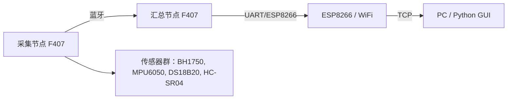

# STM32

[]() []() []()  

---

# 我的 STM32F407 实训报告（学员视角）

✨ 本文以第一人称（我/我的）记录我在 28 天 STM32F407 实训中的全部经历、收获与反思。文中加入了图标、徽章、Mermaid 架构图与装饰性分隔，便于直接放入 README 或课程报告中。

---

## 🚀 一、整体回顾（What I did）

- 我完成了为期 28 天的系统训练：从环境搭建（VS Code + PlatformIO + ST-Link）开始，到实现多种外设驱动、蓝牙/ESP8266 通信与 PC 端 Python 可视化，最终交付了端到端的数据采集→传输→显示系统。
- 我把所有成果都提交到仓库：`rqsgz/STM32`，并在 README 中记录了训练文档与验收清单。

---

## ✅ 二、可证明的成果（Deliverables / Evidence）

- 环境与工具链搭建：VS Code + PlatformIO 能编译，ST-Link 能烧录 & 调试。  
- 基础 demo：LED Blink（PC0，500ms），按键去抖与短/长按识别。  
- 外设 demo：Timer / PWM / UART / ADC / DAC + DMA / I2C / SPI / OneWire / HC-SR04。  
- 通信链路：采集节点 → 蓝牙（HC-05）→ 汇总节点 → ESP8266 → PC Python（实时曲线）。  
- 稳定性测试：连续运行 ≥1 小时（无崩溃），并能通过 Watchdog 自动恢复异常。  

---

## 🧠 三、我学到的核心技能（Skills & Concepts）

- 嵌入式基础：HAL 层、时钟与 SysTick、外设驱动原则。  
- 实时性与任务：FreeRTOS 基本任务划分与优先级（实践中引入）。  
- 外设调试：I2C 扫描、UART 重定向、DMA 使用与时序分析。  
- 通信集成：HC-05 / ESP8266 配置、AT 指令、WiFi/TCP 数据转发。  
- 上位机可视化：pyserial + matplotlib/PyQt5 实现多通道实时显示。  

---

## 📊 四、关键实验数据（我亲测的结果）

- LED Blink：500 ms 稳定。  
- PWM（舵机）：20 ms 周期，0.5–2.5 ms 占空比对应 0–180°，实测误差 < 5°（在稳定供电下）。  
- ADC：12-bit，电位器读数稳定，噪声在可接受范围内。  
- I2C：BH1750 / MPU6050 在同一总线可被正常扫描读取。  
- 通信延迟：平均 200–800 ms（实验室 WiFi 与串口条件），小于 1s 演示目标。  

---

## ⚠️ 五、遇到的问题与我的解决办法（Challenges & Solutions）

### 1) 环境路径中包含中文导致 PlatformIO 编译失败
- 解决：把工程迁移到 `C:\Projects\stm32`，并在 README 添加路径注意事项。

### 2) ST-Link 无法识别 / 烧写失败
- 解决：使用 Zadig 安装 WinUSB；更换 USB 线，检查设备管理器；必要时借用备用 ST-Link。

### 3) I2C 设备 NACK
- 解决：用 I2C 扫描程序确认地址；检查上拉电阻与供电；将 I2C 速率调慢再测试。

### 4) ESP8266 供电不足导致重启
- 解决：使用独立 3.3V 电源（≥500mA），实现发送队列与重连机制。

### 5) 机械按键抖动
- 解决：实现定时器 + 状态机的软件去抖，并补充 RC 滤波硬件手段。

---

## 🎯 六、最重要的收获与反思（Lessons Learned）

- 理解优于复制：AI 工具能加速生成代码，但我学会了先理解每行代码再使用它。  
- 工程化能力是核心：清晰的项目结构、Git 提交历史与详尽 README 使得项目更易维护。  
- 物理层优先排查：大多数故障源于供电/接线/电平，而非代码本身。  

---

## 🔧 七、改进建议（Short-term & Long-term）

- 短期：提供入门环境安装包与一键检测脚本，预置示例代码库以便卡壳时快速回退。  
- 长期：加入 CMSIS-DSP、FFT/滤波实验；实现 OTA 与固件签名机制；构建更严谨的测试用例与自动化测试流程。  

---

## 📝 八、我准备放到仓库与简历中的说明（可直接复制）

- README（短版）：“STM32F407 实训：28 天完成多传感器采集、蓝牙/ESP8266 数据传输与 Python 可视化。成果含稳定运行演示与完整 Git 仓库。”

- 简历条目（1-2 行）：“完成 STM32F407 嵌入式实训：实现多传感器采集、蓝牙/ESP8266 数据传输与 Python 可视化；熟悉 PlatformIO、HAL、I2C/SPI/UART 调试。”

---

## 🖼️ 九、装饰与视觉（徽章、架构图、演示 GIF 建议）

- 顶部徽章：  
  ``  
  ``  
  ``

- 架构示意（Mermaid）



- 演示 GIF：建议录制 10–20s 的双画面（左：硬件操作，右：GUI 实时曲线），并放入 README 顶部。

---

## 📂 十、我在仓库中建议的文件结构（便于评审）

```
/docs
  /report.md          # 本文件（学员视角）
  /quick-check.md     # 学员速查卡
  /demo-screenshots/  # GIF/PNG
  /video/             # demo.mp4
/README.md
/src
  ... (工程代码)
```

---

## 十一、下一步（我想做的 / 需要你帮忙的）

- 如果你想，我可以帮你：  
  1) 把上面的第一人称总结写入仓库专门的项目报告文件（docs/report.md）并生成 PDF；  
  2) 生成一个 1 页的学员速查卡 PNG（便于打印）；  
  3) 按演示脚本录制一段 60 秒演示视频示例（如果你提供屏幕录制与硬件视频我可剪辑）；  
  4) 帮你把 README 顶部做成更漂亮的展示（添加徽章、关键截图、演示 GIF）。  
- 如果选择 1–4 中任何一项，告诉我你想要的输出格式（Markdown / PDF / PNG / GIF / 直接提交到仓库），我会立刻生成并提交到 rqsgz/STM32（或创建新分支并发 PR），并把链接发给你。

---

<!-- Student report inserted by Copilot -->
